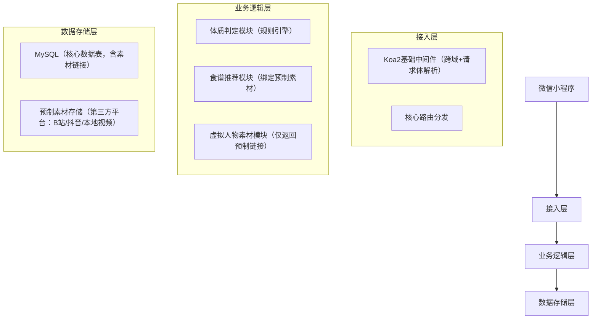

你希望虚拟人物模块以“提前录制好每种食谱对应的制作素材，在展示对应食谱时播放专属预制素材”的方式实现，这个思路完全契合大赛简化落地的需求，我会基于这个核心诉求，调整之前的简化版概要设计文档中虚拟人物相关的全部内容，确保方案简单、可落地且适配大赛演示场景。

# 微信小程序（体质判定+膳食推荐）服务端简化版概要设计文档（虚拟人物调整版）
## 文档信息
| 项目         | 内容                                   |
|--------------|----------------------------------------|
| 项目名称     | 中医体质判定与膳食推荐小程序（服务端） |
| 技术栈       | Node.js + Koa2（核心框架）+ mysql2（原生数据库操作） |
| 文档版本     | V1.1（虚拟人物预制素材版）|
| 设计目标     | 支撑小程序核心演示流程：症状采集→体质判定→食谱推荐→播放预制虚拟人物食谱制作素材，兼顾开发效率与演示效果 |

## 一、项目概述（补充虚拟人物核心逻辑）
### 1.1 项目背景
本项目为大学生创新创业大赛参赛作品，服务端轻量化实现核心业务逻辑，其中虚拟人物模块采用“预制素材+食谱绑定”的极简方案：提前录制每种食谱的虚拟人物制作讲解素材，存储为外链形式，小程序展示对应食谱时直接拉取并播放该素材。

### 1.2 核心目标（补充虚拟人物相关）
1. 提供3个核心API接口，支撑小程序端完整演示流程；
2. 基于规则引擎实现症状到体质的判定，逻辑清晰且易讲解；
3. 简化数据库操作，仅保留核心表结构，将预制素材链接与食谱绑定存储；
4. 适配本地/简易部署，保证预制素材能稳定播放，满足大赛现场演示需求。

## 二、总体架构设计（无架构调整，仅补充说明）
### 2.1 分层架构（极简版）


### 2.2 技术选型明细（补充素材播放相关）
| 层级         | 技术选型                          | 选型理由（大赛适配）|
|--------------|-----------------------------------|--------------------------------------------------------------------------|
| 核心框架     | Koa2                              | 轻量、异步语法简单，大学生易上手，仅需掌握基础用法即可开发              |
| 路由管理     | koa-router                        | Koa2官方推荐，路由配置简单，支持基本的GET/POST请求分发                  |
| 数据解析     | koa-bodyparser                    | 仅解析JSON格式请求体，满足前端症状提交需求                              |
| 跨域处理     | koa2-cors                         | 解决小程序本地调试的跨域问题，配置极简                                  |
| 数据库操作   | mysql2（原生）| 无需学习ORM框架，直接写SQL语句，降低学习成本，大赛演示足够用            |
| 素材存储     | B站/抖音（免费外链）/本地视频     | 无需云存储费用，无需配置鉴权，直接获取播放链接即可                      |
| 素材播放     | 小程序原生video组件               | 微信小程序内置组件，无需额外开发，直接播放外链/本地视频                |
| 部署方式     | 本地Node.js运行 + 小程序调试模式  | 无需云服务器、域名配置，现场连同一WiFi即可演示，零运维成本              |

## 三、核心模块详细设计（重点调整虚拟人物相关）
### 3.1 接入层设计（无调整）
```javascript
// app.js（完整可运行版）
const Koa = require('koa');
const router = require('./routes');
const bodyParser = require('koa-bodyparser');
const cors = require('koa2-cors');

const app = new Koa();

// 1. 跨域中间件（极简配置，满足本地调试）
app.use(cors({
  origin: '*', // 本地调试无需限制域名
  credentials: true
}));

// 2. 请求体解析（仅解析JSON）
app.use(bodyParser({
  enableTypes: ['json']
}));

// 3. 路由分发（仅核心接口）
app.use(router.routes()).use(router.allowedMethods());

// 启动服务（固定端口3000，便于小程序对接）
const port = 3000;
app.listen(port, () => {
  console.log(`服务端启动成功！地址：http://localhost:${port}`);
});
```

### 3.2 体质判定模块（无调整）
```javascript
// service/constitutionService.js（体质判定核心）
const mysql = require('../config/db'); // 数据库连接

/**
 * 体质判定核心逻辑（大赛简化版）
 * @param {Array} symptoms - 前端提交的症状列表
 * @returns {Object} 判定结果
 */
async function judgeConstitution(symptoms) {
  try {
    // 1. 从数据库获取体质-症状规则（也可直接写死JSON，更简单）
    const [rules] = await mysql.query(`
      SELECT c.name, s.symptom_list 
      FROM constitution c 
      LEFT JOIN symptom_rule s ON c.id = s.constitution_id
    `);

    // 2. 转换规则格式：{体质名称: [症状1, 症状2...]}
    const ruleMap = {};
    rules.forEach(item => {
      ruleMap[item.name] = JSON.parse(item.symptom_list); // 数据库存JSON字符串
    });

    // 3. 统计每个体质匹配的症状数量（简化权重为“计数”）
    const matchCount = {};
    Object.keys(ruleMap).forEach(constitution => {
      const matchSymptoms = ruleMap[constitution].filter(sym => symptoms.includes(sym));
      matchCount[constitution] = matchSymptoms.length;
    });

    // 4. 取匹配数量最多的体质（默认平和质）
    let mainConstitution = '平和质';
    let maxCount = 0;
    for (const [name, count] of Object.entries(matchCount)) {
      if (count > maxCount) {
        maxCount = count;
        mainConstitution = name;
      }
    }

    return {
      mainConstitution, // 主体质
      matchDetail: matchCount // 匹配详情（演示用）
    };
  } catch (error) {
    throw new Error(`体质判定失败：${error.message}`);
  }
}

module.exports = { judgeConstitution };
```

### 3.3 食谱推荐+虚拟人物素材模块（核心调整）
#### 3.3.1 核心逻辑
食谱推荐模块与虚拟人物素材模块合并（简化开发），查询食谱时直接返回绑定的预制素材链接，前端拿到后用原生video组件播放，无需额外接口。
#### 3.3.2 核心代码示例
```javascript
// service/recipeService.js（含预制素材链接查询）
const mysql = require('../config/db');

/**
 * 根据体质获取食谱列表（含预制虚拟人物素材链接）
 * @param {String} constitution - 体质名称
 * @returns {Array} 食谱列表（含素材链接）
 */
async function getRecipeByConstitution(constitution) {
  try {
    const [recipes] = await mysql.query(`
      SELECT id, name, ingredients, steps, video_url 
      FROM recipe 
      WHERE constitution = ?
    `, [constitution]);
    // 格式化食材和步骤（从JSON字符串转数组，便于前端展示）
    return recipes.map(recipe => ({
      ...recipe,
      ingredients: JSON.parse(recipe.ingredients),
      steps: JSON.parse(recipe.steps)
    }));
  } catch (error) {
    throw new Error(`食谱+素材查询失败：${error.message}`);
  }
}

/**
 * （可选）根据食谱ID单独获取素材链接（如需单独播放素材时用）
 * @param {Number} recipeId - 食谱ID
 * @returns {String} 预制素材链接
 */
async function getMaterialByRecipeId(recipeId) {
  try {
    const [result] = await mysql.query(`
      SELECT video_url FROM recipe WHERE id = ?
    `, [recipeId]);
    return result[0]?.video_url || '';
  } catch (error) {
    throw new Error(`素材链接查询失败：${error.message}`);
  }
}

module.exports = { getRecipeByConstitution, getMaterialByRecipeId };
```

```javascript
// controller/recipeController.js（调整后）
const recipeService = require('../service/recipeService');

/**
 * 获取食谱及对应预制虚拟人物素材链接
 * @param {Object} ctx - Koa2上下文
 */
async function getRecipe(ctx) {
  try {
    const { constitution } = ctx.query;
    if (!constitution) {
      ctx.body = { code: 400, message: '请传入体质名称' };
      return;
    }

    // 查询食谱（含预制虚拟人物素材链接）
    const recipes = await recipeService.getRecipeByConstitution(constitution);
    ctx.body = {
      code: 200,
      message: '食谱+素材查询成功',
      data: recipes
    };
  } catch (error) {
    ctx.body = {
      code: 500,
      message: error.message,
      data: null
    };
  }
}

/**
 * （可选）单独获取食谱对应的素材链接
 * @param {Object} ctx - Koa2上下文
 */
async function getMaterial(ctx) {
  try {
    const { recipeId } = ctx.query;
    if (!recipeId) {
      ctx.body = { code: 400, message: '请传入食谱ID' };
      return;
    }

    const videoUrl = await recipeService.getMaterialByRecipeId(recipeId);
    ctx.body = {
      code: 200,
      message: '素材链接查询成功',
      data: { videoUrl }
    };
  } catch (error) {
    ctx.body = {
      code: 500,
      message: error.message,
      data: null
    };
  }
}

module.exports = { getRecipe, getMaterial };
```

```javascript
// routes/index.js（补充素材接口）
const router = require('koa-router')();
const constitutionController = require('../controller/constitutionController');
const recipeController = require('../controller/recipeController');

// 体质判定接口
router.post('/api/constitution/judge', constitutionController.judge);
// 食谱+素材查询接口
router.get('/api/recipe/list', recipeController.getRecipe);
// （可选）单独素材链接查询接口
router.get('/api/recipe/material', recipeController.getMaterial);
// 健康检查接口
router.get('/api/health/check', async (ctx) => {
  ctx.body = { code: 200, message: '服务端正常运行' };
});

module.exports = router;
```

### 3.4 预制素材准备与管理（大赛版）
#### 3.4.1 素材录制要求（极简）
1. 设备：手机录制即可，无需专业设备；
2. 内容：每款食谱录制1段1-3分钟的讲解视频（虚拟人物可由团队成员扮演，或用剪映等工具添加虚拟形象贴纸）；
3. 格式：MP4格式（小程序video组件兼容最好）；
4. 命名：按“食谱名称+体质”命名（如“当归生姜羊肉汤-阳虚质.mp4”），便于管理。

#### 3.4.2 素材存储方式（2种大赛友好方案）
| 方案         | 操作步骤                                                                 | 优势                                  |
|--------------|--------------------------------------------------------------------------|---------------------------------------|
| 方案1：第三方平台外链（推荐） | 1. 上传视频到B站/抖音（设置为“仅自己可见”或“私密”）；<br>2. 复制视频播放链接；<br>3. 将链接填入数据库video_url字段。 | 无需服务器存储，播放稳定，支持跨网络访问 |
| 方案2：本地视频（仅局域网演示） | 1. 将视频放在小程序本地目录（如/pages/recipe/video/）；<br>2. video_url字段填写本地路径（如“/pages/recipe/video/当归生姜羊肉汤.mp4”）。 | 无需联网，现场演示不卡顿              |

## 四、数据模型设计（无结构调整，补充素材字段说明）
### 4.1 数据库连接配置（无调整）
```javascript
// config/db.js
const mysql = require('mysql2/promise');

// 本地MySQL连接（需提前创建数据库：constitution_recipe）
const connection = mysql.createPool({
  host: 'localhost', // 本地数据库
  user: 'root', // 默认用户名
  password: '你的数据库密码', // 本地MySQL密码
  database: 'constitution_recipe', // 数据库名
  waitForConnections: true,
  connectionLimit: 10,
  queueLimit: 0
});

module.exports = connection;
```

### 4.2 核心表结构（补充素材字段说明）
```sql
-- 1. 体质表（constitution）
CREATE TABLE IF NOT EXISTS constitution (
  id INT PRIMARY KEY AUTO_INCREMENT,
  name VARCHAR(50) NOT NULL COMMENT '体质名称（如阳虚质）'
);

-- 2. 症状规则表（symptom_rule）
CREATE TABLE IF NOT EXISTS symptom_rule (
  id INT PRIMARY KEY AUTO_INCREMENT,
  constitution_id INT COMMENT '关联体质ID',
  symptom_list JSON COMMENT '症状列表（JSON字符串）'
);

-- 3. 食谱表（recipe）- 核心，绑定预制素材链接
CREATE TABLE IF NOT EXISTS recipe (
  id INT PRIMARY KEY AUTO_INCREMENT,
  name VARCHAR(100) NOT NULL COMMENT '食谱名称',
  constitution VARCHAR(50) NOT NULL COMMENT '对应体质名称',
  ingredients TEXT COMMENT '食材（JSON字符串）',
  steps TEXT COMMENT '制作步骤（JSON字符串）',
  video_url VARCHAR(500) COMMENT '预制虚拟人物素材链接（B站/抖音外链或本地路径）'
);

-- 测试数据插入（含预制素材链接示例）
INSERT INTO constitution (name) VALUES ('阳虚质'), ('阴虚质'), ('气虚质'), ('平和质');
INSERT INTO symptom_rule (constitution_id, symptom_list) VALUES 
(1, '["畏寒","手脚冰凉","大便稀溏"]'),
(2, '["口干","手心热","失眠"]'),
(3, '["易累","气短","易感冒"]'),
(4, '[]');
INSERT INTO recipe (name, constitution, ingredients, steps, video_url) VALUES 
('当归生姜羊肉汤', '阳虚质', '["羊肉500g","当归10g","生姜30g"]', '["1. 羊肉焯水","2. 加水煮沸后慢炖1小时"]', 'https://player.bilibili.com/player.html?aid=123456'), -- B站外链示例
('银耳百合粥', '阴虚质', '["银耳10g","百合15g","大米50g"]', '["1. 银耳泡发","2. 与百合、大米同煮30分钟"]', '/pages/recipe/video/银耳百合粥.mp4'); -- 本地视频路径示例
```

## 五、API接口设计（补充素材接口）
| 接口路径                          | 请求方法 | 接口描述               | 入参示例                                  | 出参示例                                                                 |
|-----------------------------------|----------|------------------------|-------------------------------------------|--------------------------------------------------------------------------|
| /api/constitution/judge           | POST     | 体质判定               | { "symptoms": ["畏寒", "手脚冰凉"] }      | { "code":200, "message":"体质判定成功", "data":{ "mainConstitution":"阳虚质" } } |
| /api/recipe/list                  | GET      | 根据体质获取食谱+素材链接 | ?constitution=阳虚质                      | { "code":200, "data": [{ "id":1, "name":"当归生姜羊肉汤", "video_url":"https://xxx", "ingredients":["羊肉500g"...] }] } |
| /api/recipe/material              | GET      | 单独获取食谱素材链接   | ?recipeId=1                               | { "code":200, "data":{ "videoUrl":"https://xxx" } }                      |
| /api/health/check                 | GET      | 服务端健康检查（可选） | 无                                        | { "code":200, "message":"服务端正常运行" }                               |

## 六、前端适配示例（补充关键代码，大赛演示用）
小程序端用原生video组件播放预制素材，核心代码示例：
```xml
<!-- pages/recipe/detail/recipe-detail.wxml -->
<view class="recipe-detail">
  <view class="recipe-name">{{recipe.name}}</view>
  <view class="ingredients">
    <text>食材：</text>
    <text wx:for="{{recipe.ingredients}}" wx:key="index">{{item}} </text>
  </view>
  <view class="steps">
    <text>步骤：</text>
    <view wx:for="{{recipe.steps}}" wx:key="index">{{index+1}}. {{item}}</view>
  </view>
  <!-- 虚拟人物素材播放组件 -->
  <view class="material">
    <text>制作指南：</text>
    <video 
      src="{{recipe.video_url}}" 
      controls 
      autoplay="{{false}}" 
      style="width: 100%; height: 200px;"
      show-center-play-btn
    ></video>
  </view>
</view>
```

```js
// pages/recipe/detail/recipe-detail.js
Page({
  data: {
    recipe: {}
  },
  onLoad(options) {
    // 从上个页面接收食谱ID，或直接传食谱数据
    const { recipeId } = options;
    // 调用服务端接口获取食谱+素材链接
    wx.request({
      url: `http://你的局域网IP:3000/api/recipe/list?constitution=${options.constitution}`,
      method: 'GET',
      success: (res) => {
        if (res.data.code === 200) {
          const recipe = res.data.data.find(item => item.id == recipeId);
          this.setData({ recipe });
        }
      }
    });
  }
});
```

## 七、部署设计（补充素材播放说明）
### 7.1 部署前置条件（补充）
| 环境项         | 要求                  | 备注                                  |
|----------------|-----------------------|---------------------------------------|
| Node.js版本    | ≥14.0.0               | 官网下载安装，无需复杂配置            |
| MySQL版本      | ≥5.7                  | 本地安装，创建数据库并执行建表语句    |
| 小程序调试     | 开启“不校验合法域名”  | 微信开发者工具→详情→本地设置中勾选    |
| 素材播放       | 第三方外链需联网/本地视频需同目录 | 现场演示时保证网络稳定（外链方案）或视频文件已放入小程序目录（本地方案） |

### 7.2 部署步骤（补充素材相关）
1. **环境准备**：本地安装Node.js和MySQL，创建`constitution_recipe`数据库，执行建表语句，将预制素材链接填入recipe表的video_url字段；
2. **素材准备**：
   - 外链方案：将录制好的视频上传到B站/抖音，复制播放链接并更新到数据库；
   - 本地方案：将视频文件放入小程序指定目录，确保路径与数据库中的video_url一致；
3. **代码配置**：修改`config/db.js`中的MySQL密码为本地密码；
4. **启动服务**：打开终端，进入服务端目录，执行`npm install`安装依赖，再执行`node app.js`启动服务；
5. **小程序调试**：在微信开发者工具中打开小程序项目，勾选“不校验合法域名”，修改请求地址为本地服务端局域网IP，测试素材播放是否正常。

## 八、大赛适配关键说明（补充虚拟人物部分）
| 简化点                | 调整后方案                          | 优势                                  |
|-----------------------|---------------------------------------|---------------------------------------|
| 虚拟人物素材生成      | 提前录制预制素材，绑定食谱存储链接   | 无需开发动态生成逻辑，零技术门槛      |
| 素材存储              | 第三方平台外链/本地视频              | 无需云存储费用，无需配置鉴权          |
| 素材播放              | 小程序原生video组件                  | 无需额外开发，直接播放，兼容性好      |
| 素材接口              | 与食谱接口合并，仅返回链接           | 减少接口数量，降低开发和调试成本      |

### 总结
1. 虚拟人物模块核心调整为**“预制素材+食谱绑定”**，提前录制好每种食谱的讲解素材，将链接存入数据库，小程序查询食谱时同步获取素材链接并通过原生video组件播放，完全适配大赛简化落地需求；
2. 服务端仅新增1个可选的素材单独查询接口，核心逻辑无冗余，保留“症状采集→体质判定→食谱推荐→素材播放”的完整演示链路；
3. 素材存储提供“第三方外链”和“本地视频”两种方案，无需专业设备和云服务，大学生可快速完成录制和部署，保证大赛演示稳定。